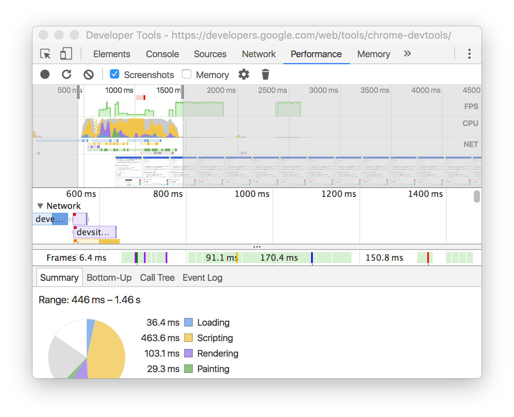

# Chrome 开发者工具

Chrome 开发者工具是一套内置于Google Chrome中的Web开发和调试工具，可用来对网站进行迭代、调试和分析。

> **提示:** 寻找最新版本的 Chrome 开发者工具, [Chrome Canary](https://www.google.com/intl/en/chrome/browser/canary.html) 总是有最新的 DevTools。

## 打开 Chrome 开发者工具

- 在 Chrome 菜单中选择 **更多工具** > **开发者工具**
- 在页面元素上右键点击，选择 “检查”
- 使用 快捷键 Ctrl+Shift+I (Windows) 或 Cmd+Opt+I (Mac)

## 了解面板

### 设备模式

使用设备模式构建完全响应式，移动优先的网络体验。

- [设备模式]()
- [测试响应和设备特定的视口]()
- [模拟传感器: 地理定位和加速计]()

### 元素面板

使用元素面板可以自由的操作 DOM 和 CSS 来迭代布局和设计页面。

- [检查和调整页面]()
- [编辑样式]()
- [编辑DOM]()

### 控制台面板

在开发期间，可以使用控制台面板记录诊断信息，或者使用它作为 shell 在页面上与 JavaScript 交互。

- [使用控制台面板]()
- [命令行交互]()

### 源代码面板

在源代码面板中设置断点来调试 JavaScript，或者通过 Workspaces（工作区）连接本地文件来使用开发者工具的实时编辑器。

- [断点调试]()
- [调试混淆的代码]()
- [使用开发者工具的Workspaces（工作区）进行持久化保存]()

### 网络面板

使用网络面板了解请求和下载的资源文件并优化网页加载性能。

- [网络面板基础]()
- [了解资源时间轴]()
- [网络带宽限制]()

### 性能面板

> **说明:** 在 Chrome 57 之后时间线面板更名为性能面板。

使用时间轴面板可以通过记录和查看网站生命周期内发生的各种事件来提高页面的运行时性能。

- [如何查看性能]()
- [分析运行时性能]()
- [诊断强制的同步布局]()

### 内存面板

> **说明:** 在 Chrome 57 之后分析面板更名为内存面板。

如果需要比时间轴面板提供的更多信息，可以使用“配置”面板，例如跟踪内存泄漏。

- [JavaScript CPU 分析器]()
- [内存堆区分析器]()

### 应用面板

> **说明:** 在 Chrome 52 之后资源面板更名为应用面板。

使用资源面板检查加载的所有资源，包括 IndexedDB 与 Web SQL 数据库，本地和会话存储，cookie，应用程序缓存，图像，字体和样式表。

- [管理数据]()

### 安全面板

使用安全面板调试混合内容问题，证书问题等等。

- [安全]()

