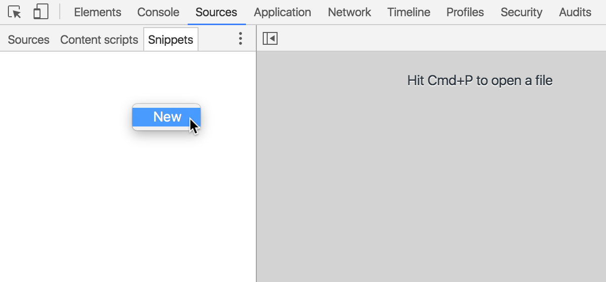
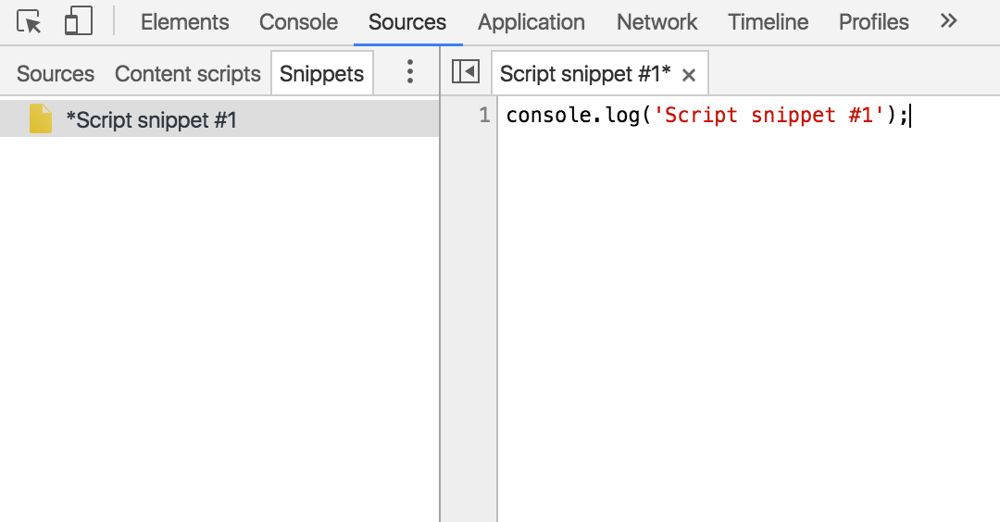
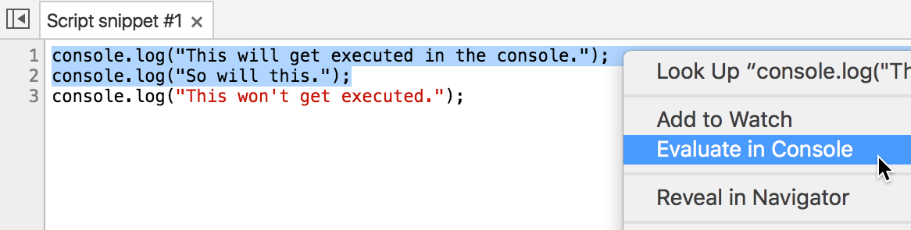

# 从任何页面运行代码段

代码段是您可以在 Chrome DevTools 的 Sources 面板中制作和执行的小脚本。 您可以从任何页面访问和运行它们。 在您运行代码段时，它会从当前已打开页面的上下文执行。

如果您有将在多个页面上重复使用的实用程序或调试脚本，可以考虑将脚本保存为代码段。

您也可以使用代码段替代[小书签](https://en.wikipedia.org/wiki/Bookmarklet)。

### 摘要

- 代码段是您可以从任何页面运行的小脚本（类似于小书签）。
- 使用“Evaluate in Console”功能可以在控制台中运行部分代码段。
- 请注意，Sources 面板中的常用功能（如断点）也可与代码段结合使用。

## 创建代码段

要创建代码段，请打开 Sources 面板，点击 Snippets 标签，在导航器中点击右键，然后选择 New。

在编辑器中输入您的代码。如果您未保存更改，您的脚本名称旁会有一个星号，如下面的屏幕截图所示。请按 Command+S (Mac) 或 Ctrl+S （Windows、Linux）以保存您的更改。

## 运行代码段

可以通过三种方式运行代码段:

- 右键点击代码段文件名（左侧窗格列出了所有代码段），然后选择 Run。
- 点击 Run 按钮 ()。
- 按 Command+Enter (Mac) 或 Ctrl+Enter（Windows、Linux）。

要在控制台中评估部分代码段，请突出显示这一部分，在编辑器中的任意位置右键点击，然后选择 Evaluate in Console，或使用键盘快捷键 Command+Shift+E (Mac) 或 Ctrl+Shift+E（Windows、Linux）。

## 查看本地修改

要查看您对代码段所做修改的差异，请在编辑器中（显示代码段时）点击右键，然后选择 Local modifications。

在控制台抽屉式导航栏中会弹出名称为 History 的新标签。

每个时间戳代表一次修改。展开时间戳旁的三角符号，查看那个时间点所做修改的差异。revert 链接可以移除修订历史记录。从 2016 年 6 月 27 日开始，apply revision content 和 apply original content 链接似乎无法按预期工作。

## 设置断点

就像在其他脚本上一样，您也可以在代码段上设置断点。请参阅[添加断点](https://developers.google.com/web/tools/chrome-devtools/debug/breakpoints/add-breakpoints)，了解如何在 Sources 面板中添加断点。

> 本文翻译自: [https://developers.google.com/web/tools/chrome-devtools/snippets](https://developers.google.com/web/tools/chrome-devtools/snippets)